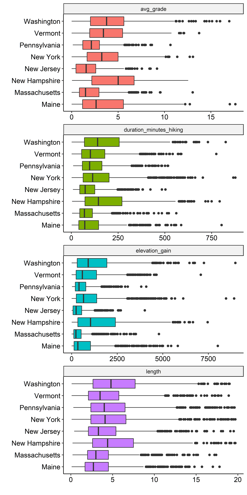
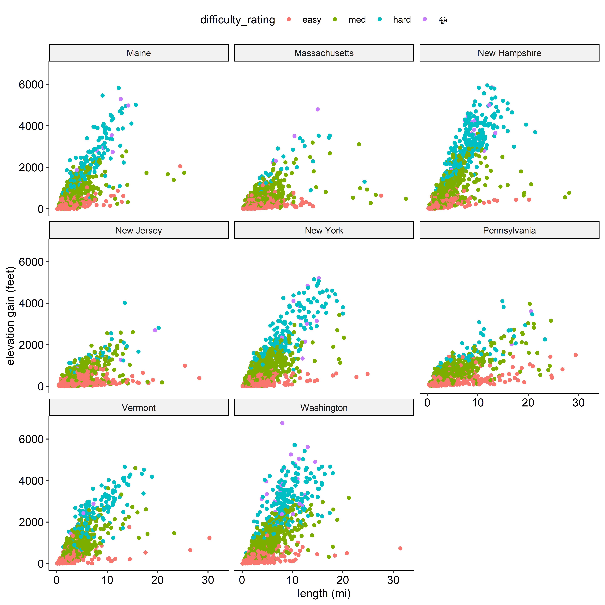

# Hiking Trip Selector

Identifies ideal clusters of hikes based on distance & distance/ease metrics

## Cleaning 

Data obtained from Alltrails using XHR requests run in python

---
## Exploration

### Trail Features by state

----

----

 ----
## Analysis

TODO: 
- [x] create relative distance metric using my home address 
- [x] identify trails that are close together
- [ ] weight trails based on reviews/ratings/difficulty etc
